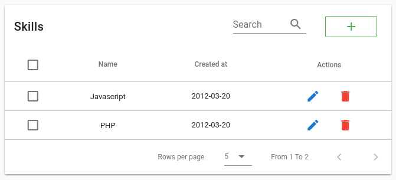
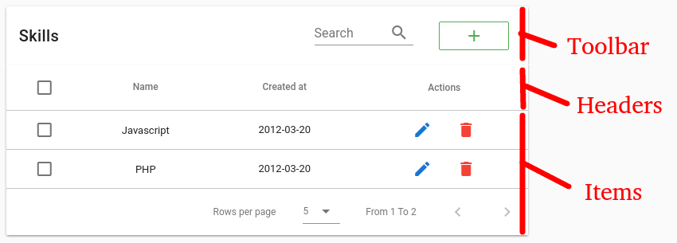

# Tabular

A table component for vue with embedded ajax pagination, sorting and filtering based on data type based on vuetify.

All you need to do is give it an endpoint, and configure it. The returned data must be a Laravel Pagination object.



# Important notice
This is still in early development, I will convert it to a package soon enough.

# Dependencies
- [Vuetify](https://vuetifyjs.com) (currently v0.15)
- [Vue moment](https://github.com/brockpetrie/vue-moment)
- [Axios](https://github.com/mzabriskie/axios)
- [optional] [Vue i18n](https://github.com/kazupon/vue-i18n/)

## Features

- Render a table with complete functionalities with a simple tag `tabular`
- Automatically fetches data with ajax
- Define columns with a simple array of objects
- Selectable columns with user defined actions that can be executed on them
- Supports search
- Supports column filtering
- Supports column sorting
- Events to give the user more controle

## Components

To make the following documentation easier to understand, we'll split Tabular to three parts.

- **Toolbar:** This is the top part of the table, it contains the title, search input, and other custom inputs that can be added using slots.

  When rows are selected, the toolbar shows a count of selected rows and action buttons that are defined by the **actions** parameter.

- **Headers:** This is the table's headers. Each column consists of a title, and optionally a sort icon and a filter icon.

- **Items:** The data rows. An edit popup can show up to edit a cell.



## Parameters

### Table parameters

- **color:** _[String]_ Table primary color. This has to be a value from [vuetify colors](https://vuetifyjs.com/style/colors)

- **headers:** list of table headers objects. each object contains options for filtering, and more. Details are in the next section

- **endpoint:** _[String]_ API endpoint to get data from, and perform updates and deletes. This will be detailed in the API Request section

- **query:** _[Object]_ object of initial query to add to the pagination request. each entry is a filter. This will be detailed in the API Request section

- **selectable:** _[Boolean]_ If set to true, rows will be selectable and actionable (You can use bulk actions on them)

- **selectedKey:** _[String]_ The object key to be put in selectable list

- **searchable:** _[Boolean]_ This adds a search capability to the table toolbar

- **deletable:** _[Boolean]_ Adds delete capability to the table toolbar

- **actions:** _[Array]_ list of actions to be executable on selected rows. The items must be objects like the following example:

  `[{name: 'dosomething', text: 'Do Something'}]`
  - **name:** _[String]_ Action name
  - **text:** _[String]_ [optional] Action text

  When an action is clicked, an event named with the action's name will be emitted, you can listen to it with `@dosomething="selected => console.log(selected)"`. The event will recieve the selected rows as payload.

- **name:** _[String]_ table name, used for i18n and other stuff, I might remove this.

- **flat:** _[Boolean]_ should the table be flat? check [vuetify docs](https://vuetifyjs.com/components/cards)

### Headers Object

Tabular has a prop named headers. The heades list consists of objects which will parametrize the table's columns, each element represents a column.

- **text:** _[String]_ Column title to be shown on the table header

- **value:** _[String]_ Column key that will be used to get the column rows data from the JSON response

- **type:** _[String]_ [optional] This is the column's type. This field will be used to set the edit inputs and filter inputs accordingly. Possible values are: `text, textarea, select, enum, date`

- **editable:** _[Boolean]_ If set to true, it allow the column rows to be edited in place. It will also send a **PUT** request to **/endpoint/{row_id}** when the column is updated. More on the API Request section.

- **filterable:** _[Boolean]_ If set to true, the column will be filterable using a popup. The popup's input type will change depending on the column's type. The filter value will be sent with an AJAX request. More on the API Request section.

- **sortable:** _[Boolean]_ Sort using this column. This will be sent with an AJAX request. More on the API Request section.

- **options:** _[Object]_ This object contains parameters for the generated inputs. Either for filters or edit inputs. For example a header with type of `select` will have a select input generated for filtering and editing, one option that the select needs is `items` which is a list of all possible values for this select.
I'll add more docs to this once I finish refactoring this part which is kind of messy.

## API Request
Tabular fetches data automatically from your endpoint. The response must be the JSON response of [Laravel 5 pagination](https://laravel.com/docs/5.5/pagination) for now.

Laravel Example:
```php
return UserModel::paginate();
```

Tabular needs axios to send API requests, this will be changed later to allow the user to user whatever he likes.
If your API needs an auth token, you need to add that to the global Axios object.

The request parameters are GET parameters, here's a list of some of them:
- page: _[integer]_ The current page
- per_page: _[integer]_ The number of items to be returned per page

Filters will add GET parameters following the format: `name=value`. For example, if we have a skill name column with a value: `name` set to `javascript`, the query will become `GET /endpoint?page=1&per_page=5&name=javascript`.

The construction of the query depends on the column type, some types will have ranges, more on that later.

If you wish to add a GET parameter to all requests, you can use the **query** prop.

As an example, if I want to construct a table to have skills of the web category only, I'll give query this object: `:query={category: 'web'}"`. This will add category to the GET parameters `GET /endpoint?category=web`.

## TODO
- Refactor code
- Use a functional approach then make a pull request to vuetify
- Decouple the logic from the view and from vuetify
- Decouple from laravel json format
- Let the user fetch the data
- Write documentation


# Testing this
This package is not ready for use yet, but you can test it if you wish.

```
git clone https://github.com/yazfield/tabular.git
cd tabular
```
```
yarn install
```
First run the API server, it contains some dummy data.
```
node server.js
```
The run the dev server
```
yarn run dev
```

# Suggestions
All suggestions and help would be appreciated.
